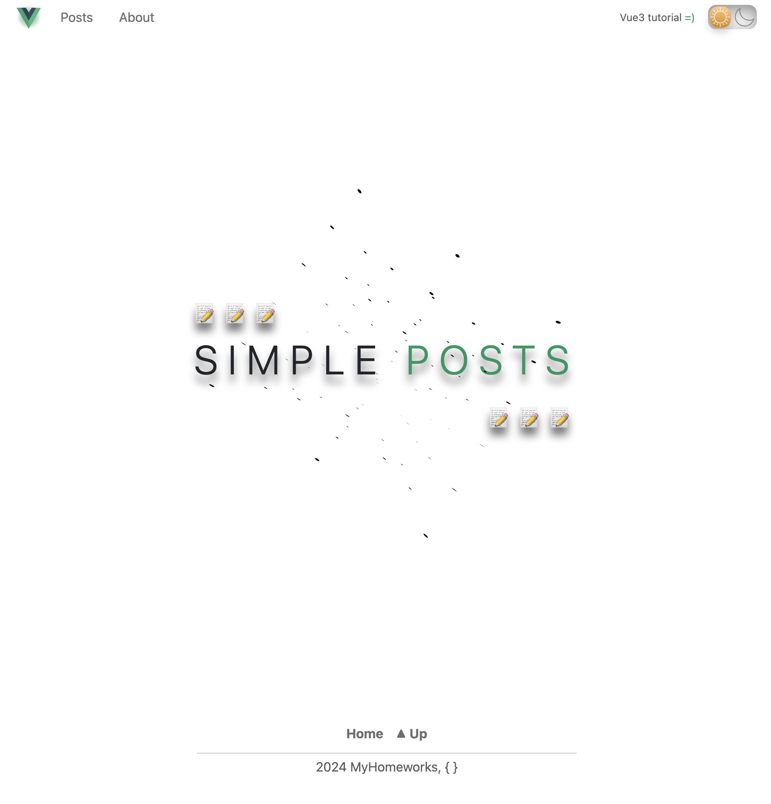
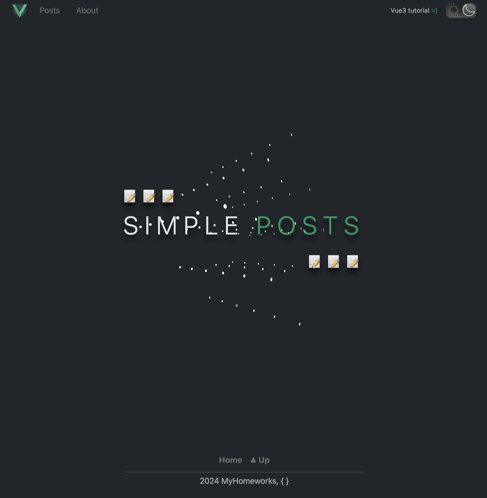
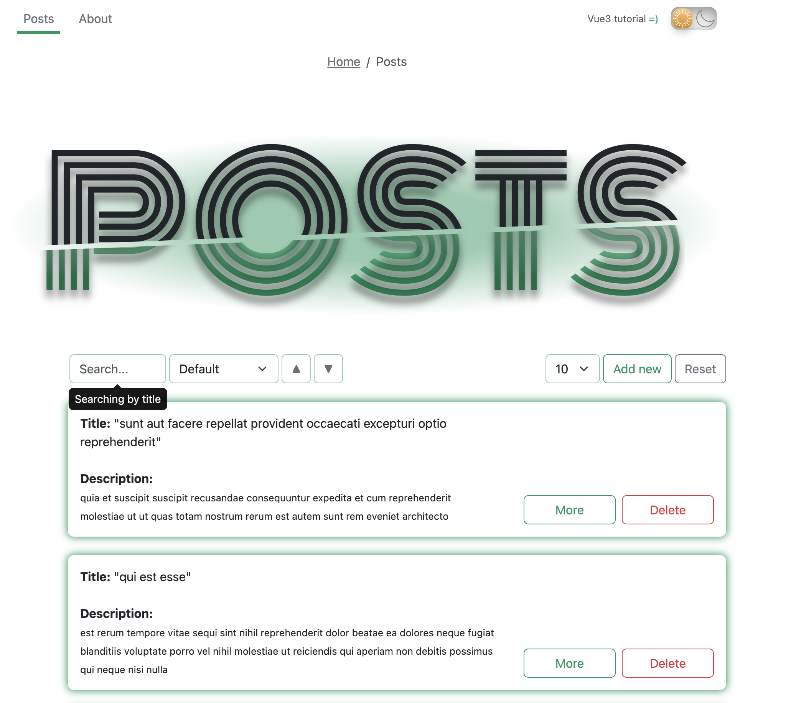
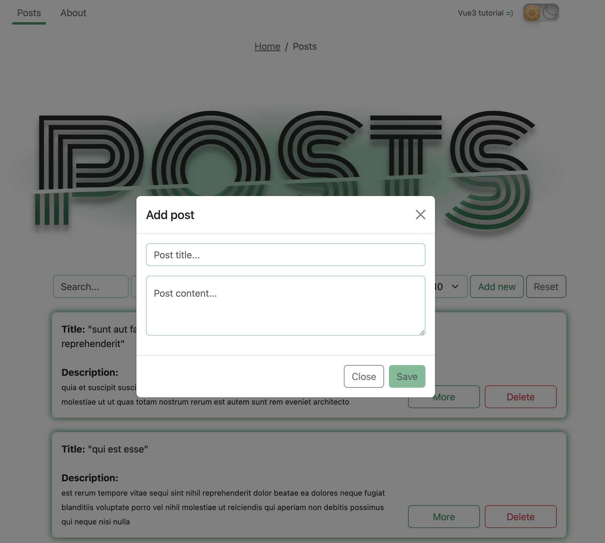
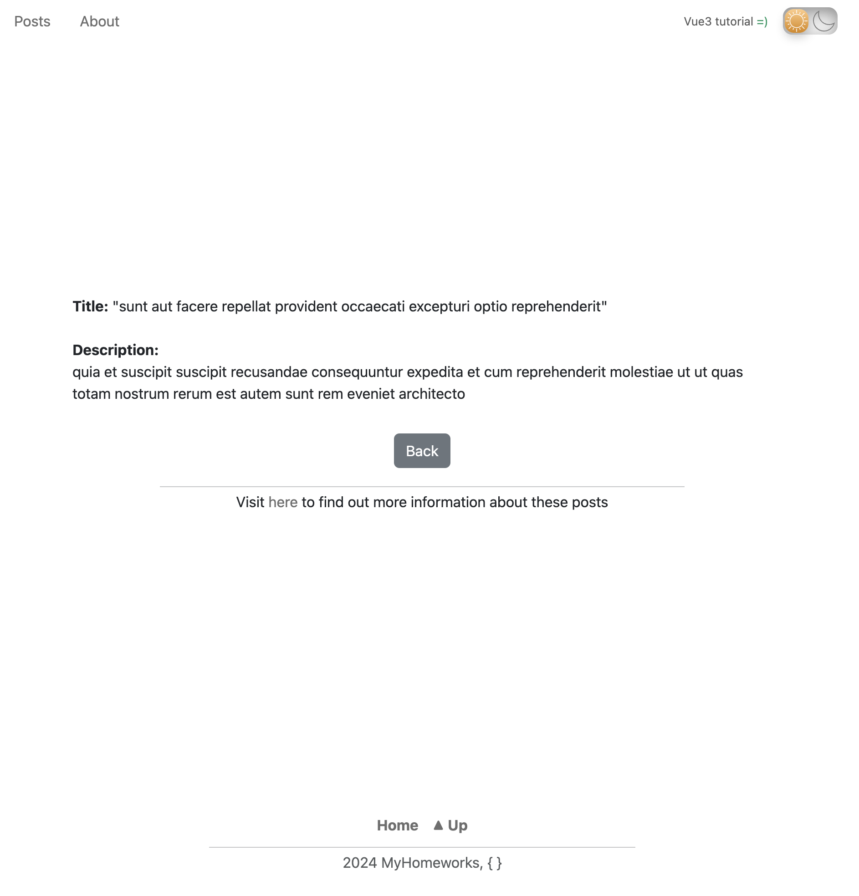
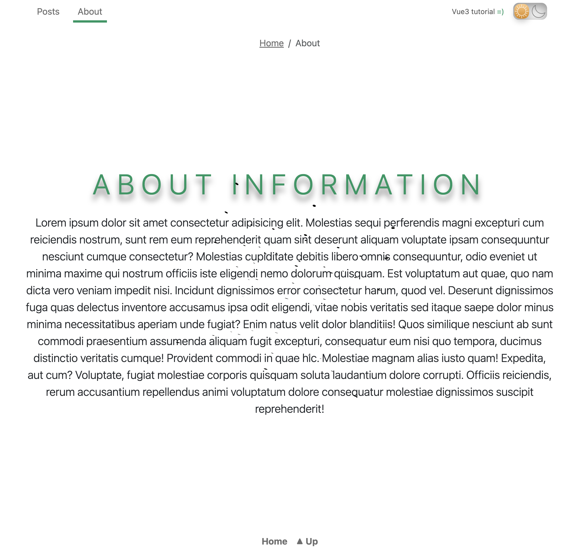
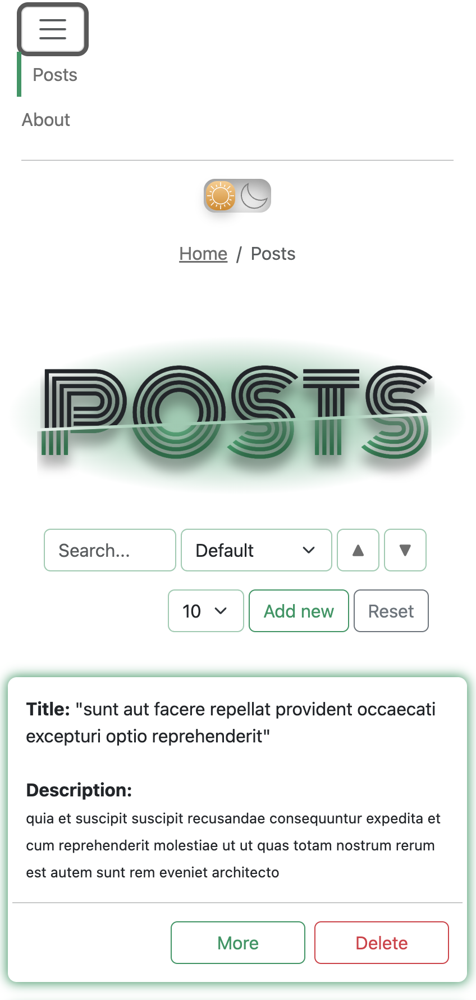
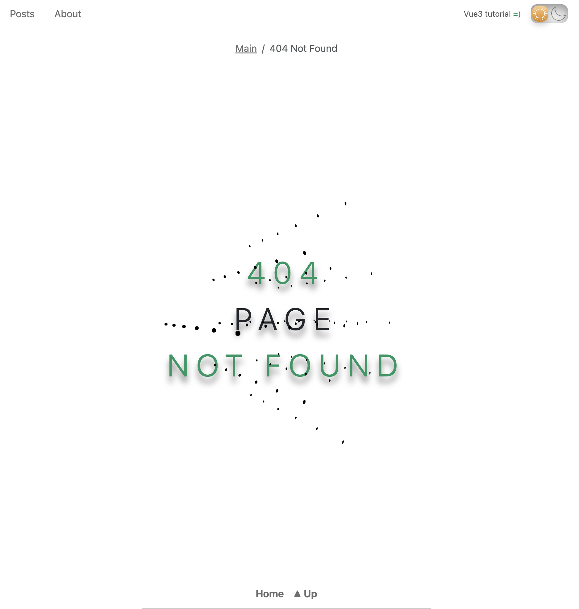

## App Description &#128209;

This is a simple frontend project based on using such technologies as: Vue3, Bootstrap5, Webpack, NGINX and Docker.

## Launch instructions &#128190;

&#9881;**Frontend**:

- Vue3;
- Bootstrap5;
- Webpack + prettier + eslint.

&#9881;**Backend**:

- Docker;
- NGINX.

<div style="display: flex; justify-content: end;">
  <p>Git and Docker should be installed locally on Your PC.</p>
</div>

---

1. Clone repository to Your local path:

    ```sh
    cd <your_local_path> && git clone <http/ssh-link>
    ```

2. Run compose:

    ```sh
    cd Posts && docker compose --env-file ./.env.public up --build    
    ```

3. After the installation is complete the web-app will start on `localhost:8080`;

- Open web-app in browser using URL: <http://localhost:8080/>

4. Stop the web-app press in current terminal:

    ```sh
    Ctrl + C
    ```

    or

    ```sh
    docker compose --env-file ./.env.public stop
    ```

5. Start again the web-app:

    ```sh
    docker compose --env-file ./.env.public start
    ```

6. To completely remove all related docker containers, docker images, volumes and related data:

    ```sh
    docker compose --env-file ./.env.public down --volumes --rmi all
    ```

    <span style="color: rgb(255, 0, 0)">After this step, it is need to go back to point №2 to run web-app again.</span>

---

### p.s

- Outer port of nginx is `8080` and could not be changed via environment.

## Screenshots &#127745;

1. Main page (light & dark themes)

<div align="center">
  
  
</div>
  
2. Posts page with content

<div align="center">
  
</div>

3. Add new post modal on page with content

<div align="center">
  
</div>

4. About and post's info pages

<div align="center">
  
  
</div>

5. Mobile look page

<div align="center">
  
</div>

6. 404 not found page

<div align="center">
  
</div>

<br>

---
