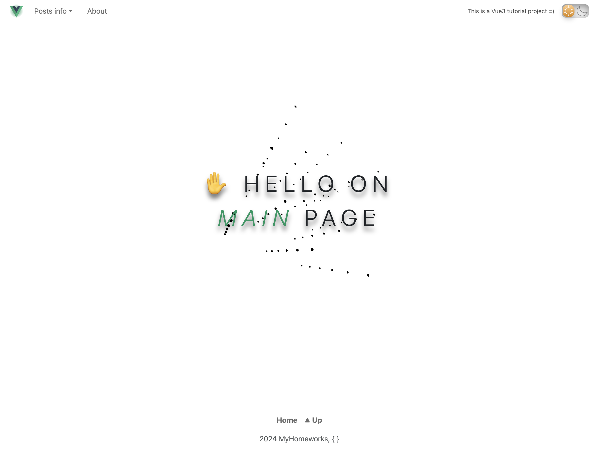
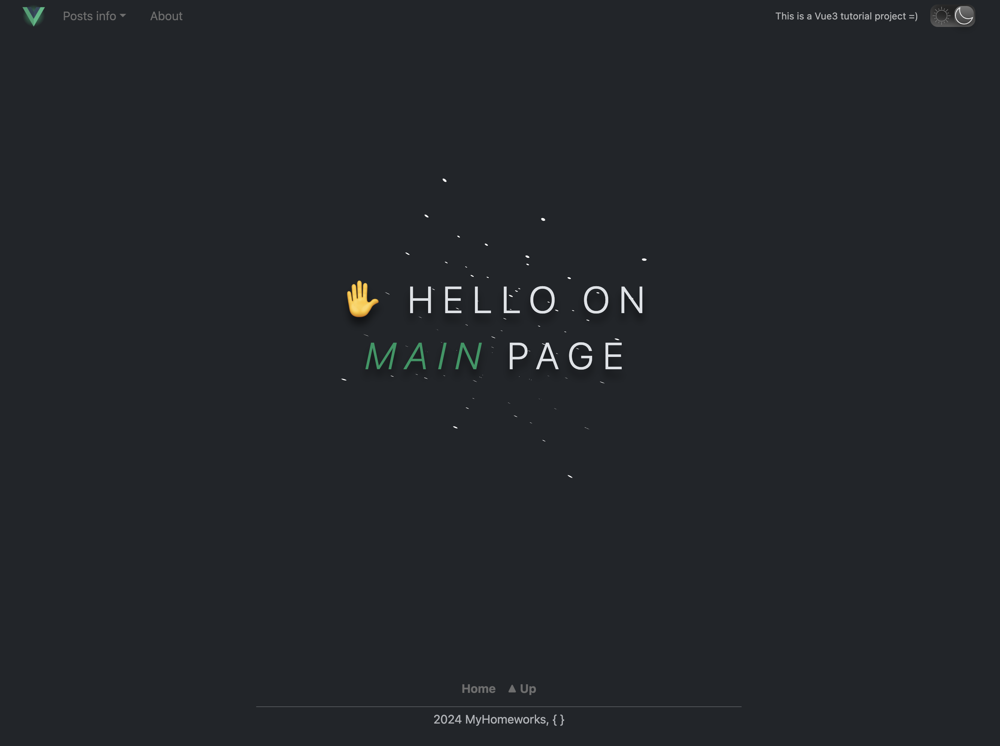
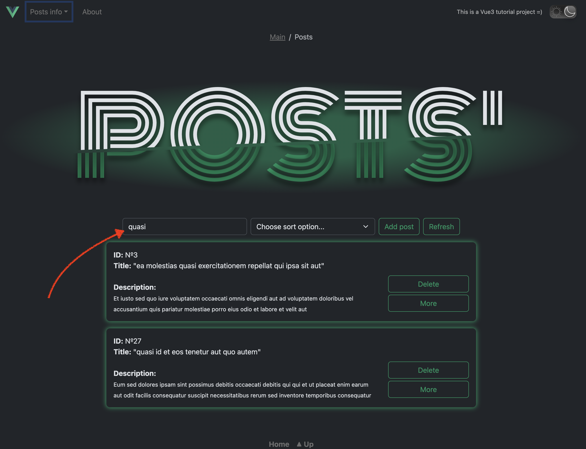
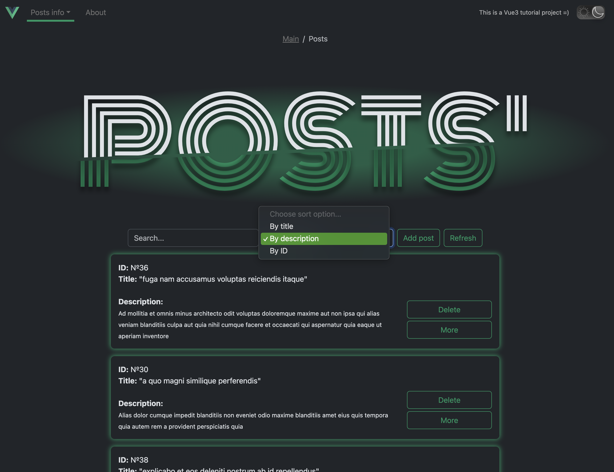
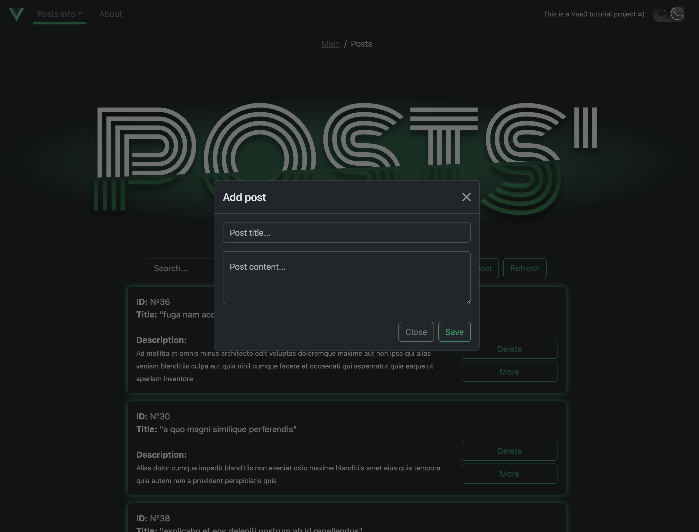
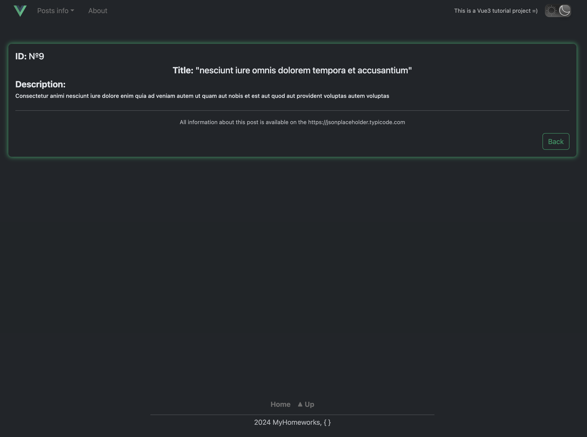
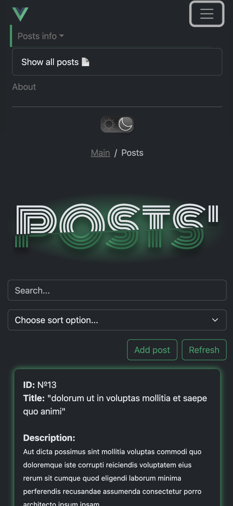
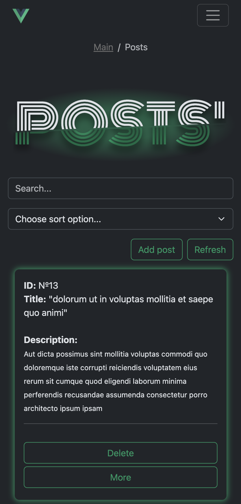
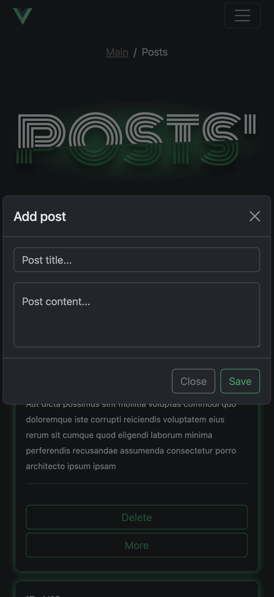

## Description

This is a project 'Posts' using:

- VueJS (Vue3);
- Bootstrap5;
- Webpack;
- Docker and Compose;
- CSS/SCSS/HTML.

## Launch instructions

1. Clone repository to your local folder;
2. Copy dev.env to .env file in the same root directory:

    `cp dev.env .env`

3. Open and follow the instructions properly in the new created .env file. *EMAIL_HOST_USER* and *EMAIL_HOST_PASSWORD* for Email sending *are expiremental*;
4. For this step you should already have installed Docker and docker-compose on your PC:

- make sure You are in project folder:

  `cd '.../project_folder'`

- Run docker-compose:

  `docker-compose up --build`

- Installation can take some time, it depends on your PC resources;
- After the installation is completed, the client-server will start automatically on 0.0.0.0:3000;
- Open app using <http://0.0.0.0:3000/> in your browser;

5. The superuser (admin) has been already created;

- You can login under current superuser using standart credentials:

  `login: admin; pass: admin`

- For password change use:

   `cd '.../project_folder' && python3 manage.py changepassword admin`

- Or You can manually create superuser for Your own purpose:

   `cd '.../project_folder' && python3 manage.py createsuperuser`

- Note, that:
  - Add/edit/delete posts only via admin-panel (Users can not to do that);
  - Add comments only for registered and authenticated Users.

6. Note that DataBase in project - MySQL;
7. To stop the server: `Ctrl+C`;
8. To completely remove all created docker containers, images and volumes:

   `docker-compose down --volumes`.

**p.s.:**

--> ...

### Screenshots

1. *Main page (white & dark themes)*

2. *Main posts page and dynamic search*

3. *Three sort options*

4. *Add Your own new posts with modal*

6. *Post detailed info*

7. *Mobile look like*

  
  
  

